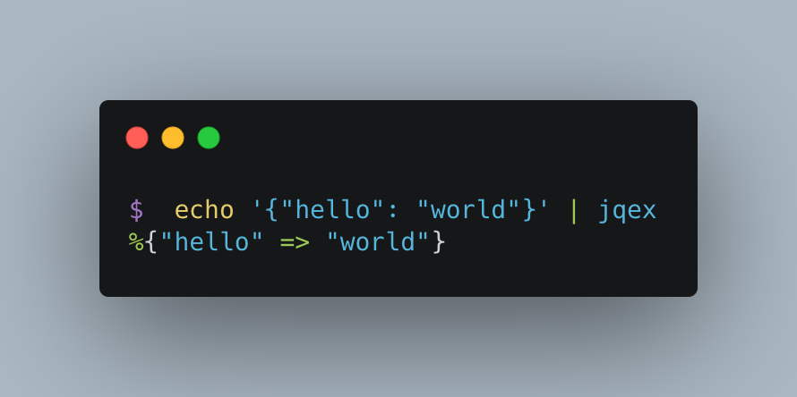

# Jqex
`jqex` is a command-line tool written as an [escript](https://hexdocs.pm/mix/master/Mix.Tasks.Escript.Build.html) to convert JSON into Elixir terms, inspired by the amazing [jq](https://stedolan.github.io/jq/)

## Installation

1. Install Elixir with [asdf](https://github.com/asdf-vm/asdf-elixir)
2. Clone this repository
3. Run `mix escript.build`
4. Add `./bin/` to your `$PATH`

## Example

